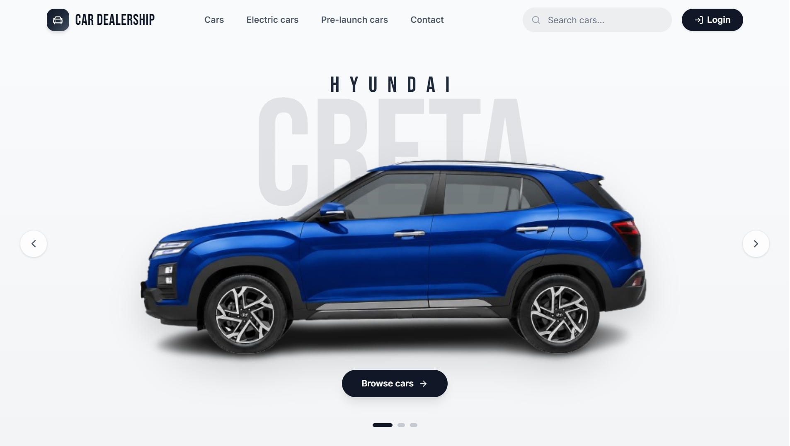
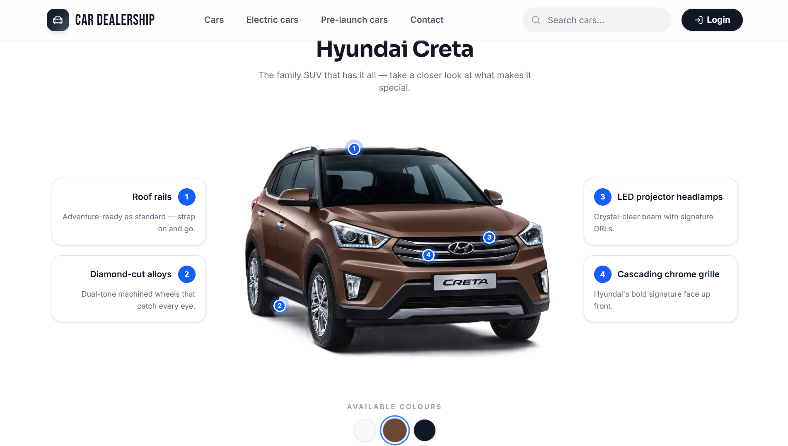
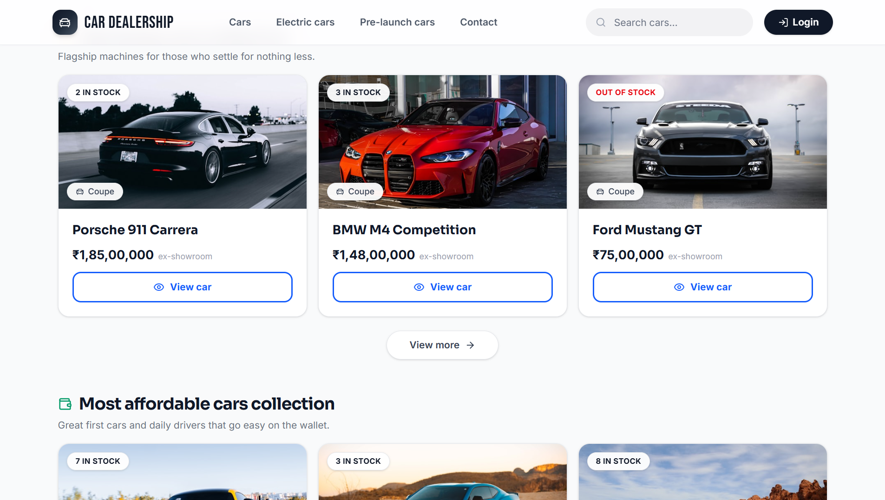
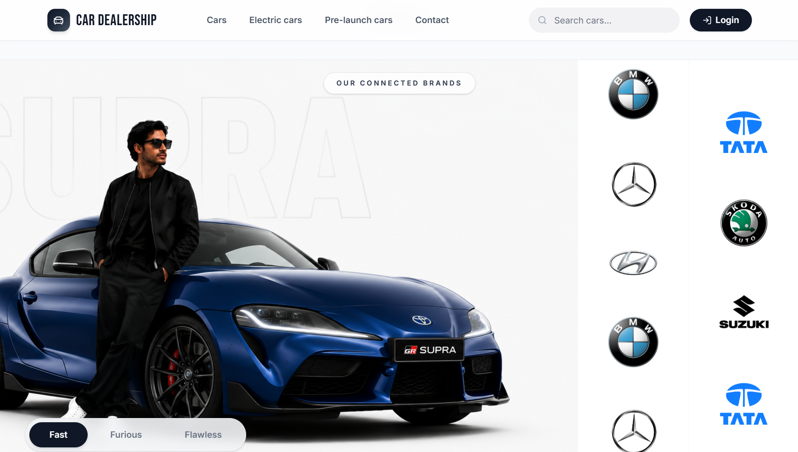
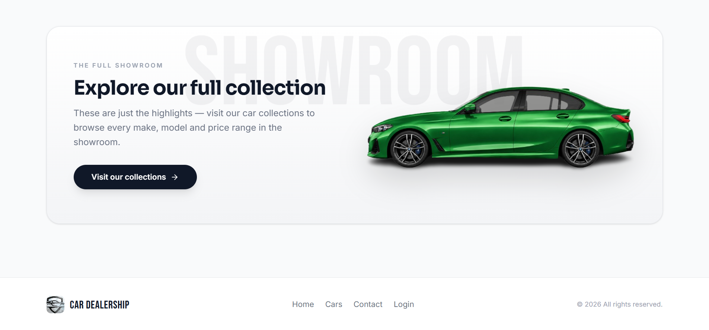
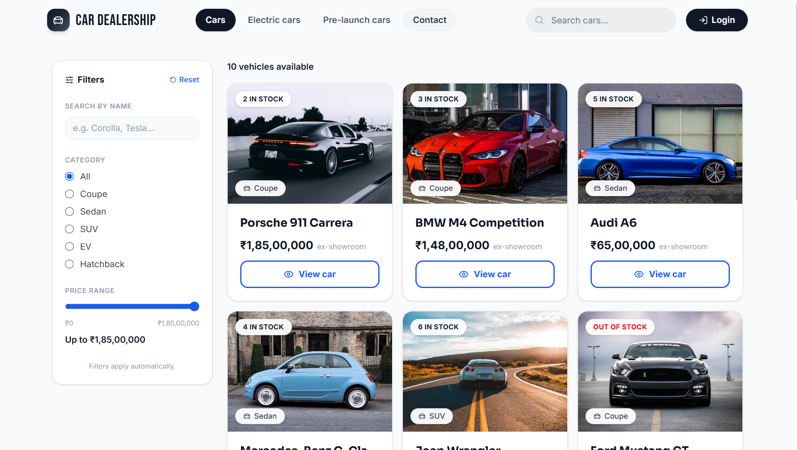
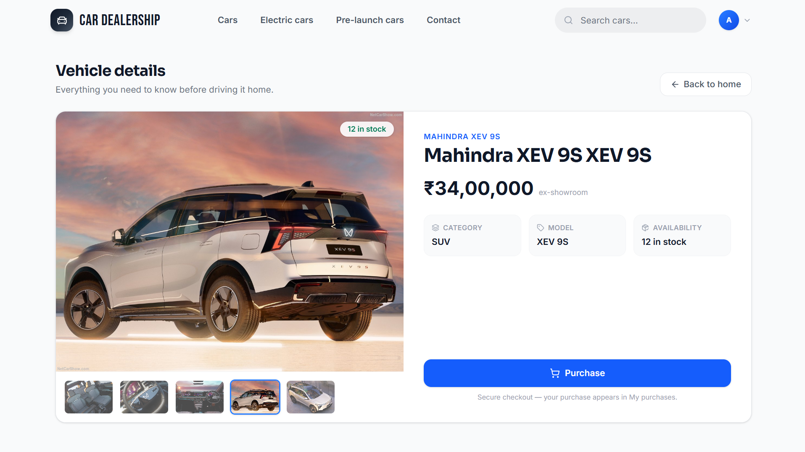

# 🚗 Car Dealership Inventory System

**[🌐 Live site](https://car-dealership-inventory-system-delta.vercel.app)** · **[🧪 Test report](https://claude.ai/code/artifact/16f81e13-550c-4251-bf54-92354162d31e)** · [test.md](test.md)

A full-stack **Car Dealership Inventory System** built for the Incubyte TDD Kata — Node.js/TypeScript + Express + MongoDB on the backend, React + Tailwind on the frontend, built **test-first** end to end (278 tests, red → green visible throughout the commit history).

Sign in with one click — the sign-in page has **Demo user login** and **Demo admin login** buttons, no credentials to type. The whole site supports **light and dark mode**, following your system preference by default and switchable from the navbar.

---

## 1. About the project

Visitors land on a showroom-style home page — a full-screen hero with drive-mode photo tabs (Fast / Furious / Flawless) and auto-scrolling brand logos, a Hyundai Creta feature spotlight with callout markers, and curated **Luxury** / **Most affordable** collections. The **Cars** page lists the full inventory with a filter sidebar (name search, category, a 0-to-max price slider) where **filters apply automatically**. Every card opens a **detail page**; purchasing happens there and is disabled at zero stock. Logged-in users get **My purchases** (photo, price paid, date — the record survives even if the car is later deleted). Admins manage inventory from a panel with sidebar sections — inventory, registered users (with last-login times) and the contact-form inbox. Listings take **multiple photos** (first is the main image, the rest become the detail-page gallery), stored on disk in development and on **Cloudinary** in production. Prices render in **Indian rupees** with lakh/crore grouping.

**Key behaviours (all pinned by tests):**

- JWT auth with roles — public registration can never create an admin, and there is **no admin-registration endpoint at all**: admin accounts exist only because the server creates them on start.
- Login answers 401 identically for unknown email and wrong password (no user enumeration).
- Purchases decrement stock **atomically** (`quantity > 0` guard) — stock can never go negative, even under concurrent purchases — and store an immutable price snapshot.
- Search supports `q` (partial, case-insensitive, make *or* model) plus make/model/category/price-range filters.
- Broken/missing vehicle photos fall back to a placeholder; deleted vehicles degrade gracefully in purchase history.

> **Design decision:** browsing (list/search/detail) is intentionally **public** so visitors can window-shop before signing up — the navbar shows *Login* until then. Purchasing, purchase history, uploads and all admin operations remain JWT-protected, with admin-only rules enforced on both the API (403) and the UI (route guards). This is a deliberate storefront-UX deviation from the kata's "all vehicle endpoints protected" reading; flipping the three GET routes back behind `requireAuth` is a one-line-per-route change in `backend/src/routers/vehicle.routes.ts`.

**Tech stack:** Express 5 · Mongoose 9 · JWT + bcrypt · Zod · Multer | React 19 · Vite · Tailwind v4 · React Router 7 · lucide-react | Jest + Supertest | Vitest + React Testing Library

---

## 2. Setup — run it locally

### Prerequisites

- **Node.js 20+**
- **MongoDB** on `mongodb://127.0.0.1:27017` (Community Server, or `docker run -d -p 27017:27017 mongo`)

### Backend

```bash
cd backend
npm install
cp .env.example .env        # then fill the values (table below)
npm run seed                # optional: 10 example cars with photos
npm run dev                 # http://localhost:3000
```

### Frontend

```bash
cd frontend
npm install
cp .env.example .env        # VITE_API_URL already points at the local backend
npm run dev                 # http://localhost:5173
```

### Demo access (zero setup)

The server **creates both demo accounts on startup**, and the sign-in page has a one-click button for each — no credentials to type:

> **Admin:** `admin@cardealership.com` · `Admin@123`
> **Customer:** `user@cardealership.com` · `User@123`

Admin accounts are **only** created by the server this way. There is no admin-registration endpoint, so no request can ever mint an admin — public registration always produces a customer, even if the body asks for `role: ADMIN`. Override the demo credentials with `DEFAULT_ADMIN_*` / `DEFAULT_USER_*` in `backend/.env`.

### Environment variables

| File | Variable | Example |
|---|---|---|
| `backend/.env` | `PORT` | `3000` |
| | `MONGODB_URI` | `mongodb://127.0.0.1:27017/car_dealership` |
| | `JWT_SECRET` | any strong string |
| | `CORS_ORIGIN` | `http://localhost:5173` |
| | `DEFAULT_ADMIN_PASSWORD` | optional — overrides `Admin@123` |
| | `DEFAULT_USER_PASSWORD` | optional — overrides `User@123` |
| `frontend/.env` | `VITE_API_URL` | `http://localhost:3000/api` |

> Tests never touch your dev data — the backend suite runs against a separate `car_dealership_test` database that is wiped between tests.

### API reference

Every response uses the envelope `{ statusCode, message, data }`.

| Method | Endpoint | Access |
|---|---|---|
| POST | `/api/auth/register` · `/api/auth/login` | Public |
| GET | `/api/admin/users` | **Admin** |
| POST | `/api/contact` | Public |
| GET | `/api/contact` | **Admin** |
| GET | `/api/vehicles` · `/api/vehicles/search` · `/api/vehicles/:id` | Public browsing |
| POST | `/api/vehicles` | **Admin** |
| PUT / DELETE | `/api/vehicles/:id` | **Admin** |
| POST | `/api/vehicles/:id/purchase` | Authenticated |
| POST | `/api/vehicles/:id/restock` | **Admin** |
| POST | `/api/uploads/vehicle-image` | **Admin** (multipart) |
| GET | `/api/users/me` · `/api/users/me/purchases` | Authenticated |

---

## 3. Screenshots

### Landing page

The featured-car hero: one car centred with its name set huge behind it, sliding to the next every few seconds.



### Feature spotlight

Numbered callouts pinned to the actual features of the car, with colour swatches that swap the photo.



### Curated collections

Luxury and most-affordable collections, each card showing live stock and opening the full listing.



### Connected brands

The brands band, with the logo rails scrolling in opposite directions.



### Closing invite & footer

The closing showroom invite that ends the landing page.



### Full collection

The Cars page the invite leads to: name search, category filter and a price slider that all apply as soon as they change.



### Vehicle details

Photo gallery — click a thumbnail to bring it up top — alongside the specs and the purchase action.



### Admin panel

Sidebar sections for inventory, users and messages; the inventory form handles multi-photo upload, fuel type and the pre-launch flag.


---

## 4. My AI Usage

### Which AI tools I used

- **Claude Code** (Anthropic's CLI agent running the Claude Fable 5 model) — my pair programmer for the entire project.

### How I used it

- **TDD loop:** for every module I had Claude write the failing test suite first, reviewed the contract it encoded, then had it implement the minimum code to go green. The `test(...) (red)` / `feat(...) (green)` commit pairs in the history come straight from this loop.
- **Edge cases:** I pushed edge-case prompts before implementation — concurrent purchase of the last car, admin-role injection on register, user enumeration via login errors, deleted-vehicle purchase history, broken image URLs, nonsense restock quantities — and each became a red test first (the full list is in [PROMPTS.md](PROMPTS.md)).
- **Boilerplate & scaffolding:** Vite/Tailwind/Vitest setup, Express skeleton, Mongoose schemas, the zod-validated typed API layer, multer upload pipeline.
- **Debugging:** Claude diagnosed real bugs — an ESM import-hoisting issue where `CORS_ORIGIN` was read before `.env` loaded (CORS header silently missing), Jest × ESM `import.meta` failures, Mongoose 9 deprecations.
- **Design iterations:** I drove the look through many rounds — light theme, sliding split auth card, top-navbar storefront, full-screen drive-mode hero using my own photo/logo assets, the Creta spotlight — Claude researched professional dealer sites on the web and implemented each direction; I rejected and redirected several versions.
- **Verification:** after every feature Claude ran both test suites and drove the real app in a browser against the live backend (registering, uploading a photo, purchasing, filtering) before I accepted it.

### My reflection

AI made the TDD discipline *cheaper to keep*: writing an exhaustive failing suite is the step I'd normally shortcut, and generating it first (then reading it as a contract) kept me honest. The value stayed high only because I stayed in the driver's seat — I redirected designs repeatedly, questioned defaults, and treated every generated test as something to review rather than trust. It caught bugs I'd have burned hours on (the CORS/env-loading one was genuinely subtle), and it also produced things I pushed back on — which is exactly why nothing merged without tests passing and a review. Net effect: it felt like pairing with a tireless, very fast engineer who still needs a decision-maker.

Per the kata policy, every AI-assisted commit carries a `Co-Authored-By` trailer, and my complete prompt history is in [PROMPTS.md](PROMPTS.md).

---

## 5. Test report

```bash
cd backend  && npm test          # or npm run test:coverage
cd frontend && npm test
```

| Suite | Test files | Tests | Result |
|---|---|---|---|
| Backend — Jest + Supertest (real MongoDB, no mocks) | 11 | **96** | ✅ all passing |
| Frontend — Vitest + React Testing Library | 19 | **104** | ✅ all passing |
| **Total** | **30** | **200** | ✅ |

Backend coverage (`npm run test:coverage`):

| Statements | Branches | Functions | Lines |
|---|---|---|---|
| **97.38%** | **97.18%** | **97.77%** | **97.29%** |

Coverage spans auth and role rules, validation failures, out-of-stock and concurrency protection, upload-to-disk verification, search semantics and the purchase audit trail. Frontend tests render real components and mock only at the API-module boundary.

### TDD process

Every feature landed as a red commit (failing tests defining the contract) followed by a green commit (minimum implementation). Trace pairs like:

```
test(vehicle-detail): add failing tests for the vehicle detail page (red)
feat(vehicle-detail): vehicle detail page with purchase moved off the cards (green)
test(image-upload): add failing tests for image upload ... (red)
feat(image-upload): local image uploads, Home page rename and filter sidebar (green)
```

